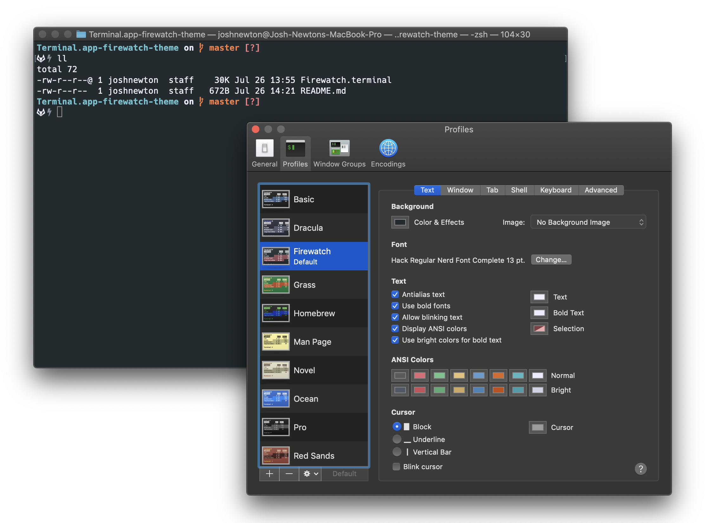

# Terminal.app Firewatch Theme

This is a Firewatch theme / profile for the built in MacOS Terminal. The original Firewatch theme was created by [Sebastian Szturo](https://github.com/SebastianSzturo) as an [atom syntax theme](https://atom.io/themes/firewatch-syntax) which was ported to a [HyperTerm theme](https://github.com/benadamstyles/hyperterm-firewatch) by [Ben Styles](https://github.com/leeds-ebooks). It was originally inspired by the [Firewatch game](http://www.firewatchgame.com/).

## Install

Clone or download this repository and double click on the 'Firewatch.terminal' file.

## License

MIT © [Josh Newton](https://imjoshnewton.me/)
